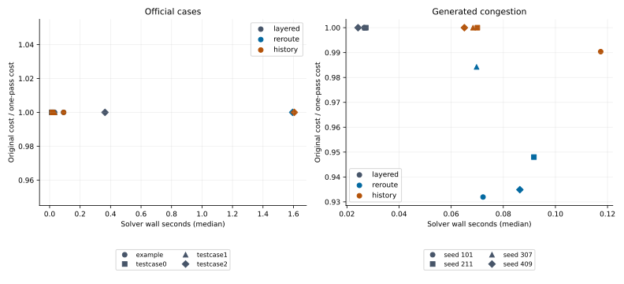
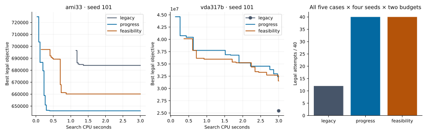
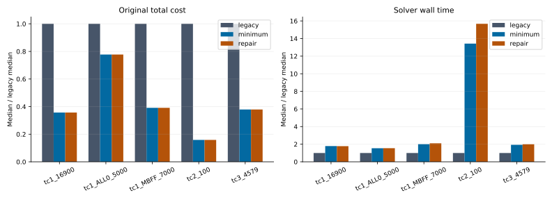

# Measured interview experiments

Generated from complete raw reports with `python3 benchmarks/report.py`. All failed attempts remain in [JSON](summary.json) and [CSV](summary.csv).

Timing repetitions estimate run-to-run variation; solver seeds measure search variation. Runs were serial on a shared Intel Xeon E5-2620 v4 host, GCC 11.4 Release. External load and CPU frequency were not controlled. No dedicated-runner performance threshold is claimed.

## routing-study

Serial rotating variant order. Same maximum total wall budget including initialization; solvers may finish early. Failures retained.

[Raw evidence](../../benchmarks/results/interview-routing-study.json). Runtime range is min–max across all attempts, including failures. Cost range includes only legal solutions.

| Dataset | Strategy | Budget | Legal / attempts | Legal cost: median [min, max] | Wall seconds: median [min, max] | Peak RSS KiB: median |
|---|---|---|---|---|---|---|
| testcase0 | layered | 0.5 | 3/3 | 1780 [1780, 1780] | 0.01366 [0.01338, 0.01608] | 3728 |
| testcase0 | reroute | 0.5 | 3/3 | 1780 [1780, 1780] | 0.01655 [0.0158, 0.01677] | 4080 |
| testcase0 | history | 0.5 | 3/3 | 1780 [1780, 1780] | 0.01681 [0.01572, 0.0177] | 3728 |
| testcase0 | layered | 2.0 | 3/3 | 1780 [1780, 1780] | 0.01329 [0.01226, 0.01505] | 3764 |
| testcase0 | reroute | 2.0 | 3/3 | 1780 [1780, 1780] | 0.01641 [0.01639, 0.01744] | 3720 |
| testcase0 | history | 2.0 | 3/3 | 1780 [1780, 1780] | 0.01645 [0.01565, 0.01673] | 3888 |
| testcase1 | layered | 0.5 | 3/3 | 6341 [6341, 6341] | 0.01852 [0.01832, 0.01867] | 4116 |
| testcase1 | reroute | 0.5 | 3/3 | 6341 [6341, 6341] | 0.032 [0.03015, 0.03284] | 4004 |
| testcase1 | history | 0.5 | 3/3 | 6341 [6341, 6341] | 0.03177 [0.03027, 0.03259] | 3836 |
| testcase1 | layered | 2.0 | 3/3 | 6341 [6341, 6341] | 0.01736 [0.01532, 0.018] | 3820 |
| testcase1 | reroute | 2.0 | 3/3 | 6341 [6341, 6341] | 0.03245 [0.03222, 0.03432] | 4060 |
| testcase1 | history | 2.0 | 3/3 | 6341 [6341, 6341] | 0.03258 [0.03137, 0.03303] | 3808 |
| testcase2 | layered | 0.5 | 3/3 | 1.367e+05 [1.367e+05, 1.367e+05] | 0.3981 [0.3599, 0.432] | 5772 |
| testcase2 | reroute | 0.5 | 3/3 | 1.367e+05 [1.367e+05, 1.367e+05] | 0.5373 [0.5302, 0.5377] | 5812 |
| testcase2 | history | 0.5 | 3/3 | 1.367e+05 [1.367e+05, 1.367e+05] | 0.5374 [0.5367, 0.5378] | 5900 |
| testcase2 | layered | 2.0 | 3/3 | 1.367e+05 [1.367e+05, 1.367e+05] | 0.3634 [0.357, 0.4011] | 5756 |
| testcase2 | reroute | 2.0 | 3/3 | 1.367e+05 [1.367e+05, 1.367e+05] | 1.595 [1.533, 1.679] | 5924 |
| testcase2 | history | 2.0 | 3/3 | 1.367e+05 [1.367e+05, 1.367e+05] | 1.605 [1.601, 1.611] | 5928 |
| example | layered | 0.5 | 3/3 | 2.91e+04 [2.91e+04, 2.91e+04] | 0.03082 [0.02574, 0.03343] | 4152 |
| example | reroute | 0.5 | 3/3 | 2.91e+04 [2.91e+04, 2.91e+04] | 0.0917 [0.09078, 0.0937] | 4044 |
| example | history | 0.5 | 3/3 | 2.91e+04 [2.91e+04, 2.91e+04] | 0.08329 [0.07378, 0.08546] | 4208 |
| example | layered | 2.0 | 3/3 | 2.91e+04 [2.91e+04, 2.91e+04] | 0.03269 [0.03065, 0.03583] | 4276 |
| example | reroute | 2.0 | 3/3 | 2.91e+04 [2.91e+04, 2.91e+04] | 0.09153 [0.07464, 0.09276] | 4024 |
| example | history | 2.0 | 3/3 | 2.91e+04 [2.91e+04, 2.91e+04] | 0.09202 [0.08568, 0.09226] | 4176 |

## routing-generated

Serial rotating variant order. Equal maximum routing wall budgets include initial routing, exclude parsing/reporting. Wrapper wall time recorded separately. Solvers may finish early; failures retained.

[Raw evidence](../../benchmarks/results/interview-routing-generated.json). Runtime range is min–max across all attempts, including failures. Cost range includes only legal solutions.

| Dataset | Strategy | Budget | Legal / attempts | Legal cost: median [min, max] | Wall seconds: median [min, max] | Peak RSS KiB: median |
|---|---|---|---|---|---|---|
| congestion-24x24-40-101 | layered | 1.0 | 3/3 | 2784 [2784, 2784] | 0.02659 [0.02614, 0.02683] | 3856 |
| congestion-24x24-40-101 | reroute | 1.0 | 3/3 | 2594 [2594, 2594] | 0.07222 [0.07071, 0.07236] | 3860 |
| congestion-24x24-40-101 | history | 1.0 | 3/3 | 2757 [2757, 2757] | 0.1174 [0.1137, 0.1175] | 3948 |
| congestion-24x24-40-211 | layered | 1.0 | 3/3 | 3430 [3430, 3430] | 0.02726 [0.02602, 0.02732] | 3780 |
| congestion-24x24-40-211 | reroute | 1.0 | 3/3 | 3251 [3251, 3251] | 0.09174 [0.09159, 0.09229] | 4164 |
| congestion-24x24-40-211 | history | 1.0 | 3/3 | 3430 [3430, 3430] | 0.07004 [0.06735, 0.07357] | 3820 |
| congestion-24x24-40-307 | layered | 1.0 | 3/3 | 2895 [2895, 2895] | 0.02683 [0.02607, 0.02718] | 4020 |
| congestion-24x24-40-307 | reroute | 1.0 | 3/3 | 2850 [2850, 2850] | 0.06975 [0.06951, 0.07094] | 3820 |
| congestion-24x24-40-307 | history | 1.0 | 3/3 | 2895 [2895, 2895] | 0.06838 [0.06223, 0.06973] | 3860 |
| congestion-24x24-40-409 | layered | 1.0 | 3/3 | 2799 [2799, 2799] | 0.02426 [0.0231, 0.02506] | 4140 |
| congestion-24x24-40-409 | reroute | 1.0 | 3/3 | 2617 [2617, 2617] | 0.08635 [0.08603, 0.08732] | 4104 |
| congestion-24x24-40-409 | history | 1.0 | 3/3 | 2799 [2799, 2799] | 0.06506 [0.05875, 0.06595] | 4164 |

## policy-evaluation

Serial paired seeds, rotating policy order. Single restart. Fixed CPU budgets for quality; fixed iterations for instrumentation. All failures retained; cost pairs require both legal.

[Raw evidence](../../benchmarks/results/interview-policy-evaluation.json). Runtime range is min–max across all attempts, including failures. Cost range includes only legal solutions.

| Dataset | Strategy | Budget | Legal / attempts | Legal cost: median [min, max] | Wall seconds: median [min, max] | Peak RSS KiB: median |
|---|---|---|---|---|---|---|
| ami33 | legacy | 1 | 0/4 | — | 1.028 [1.016, 1.066] | 4210 |
| ami33 | progress | 1 | 4/4 | 6.522e+05 [6.46e+05, 6.589e+05] | 1.023 [1.015, 1.065] | 4302 |
| ami33 | feasibility | 1 | 4/4 | 6.582e+05 [6.578e+05, 6.601e+05] | 1.073 [1.047, 1.119] | 4208 |
| ami33 | legacy | 3 | 4/4 | 6.763e+05 [6.645e+05, 6.989e+05] | 3.042 [3.018, 3.054] | 4236 |
| ami33 | progress | 3 | 4/4 | 6.501e+05 [6.46e+05, 6.564e+05] | 3.025 [3.018, 3.101] | 4048 |
| ami33 | feasibility | 3 | 4/4 | 6.548e+05 [6.525e+05, 6.601e+05] | 3.025 [3.019, 3.064] | 4232 |
| ami49 | legacy | 1 | 0/4 | — | 1.02 [1.015, 1.076] | 4246 |
| ami49 | progress | 1 | 4/4 | 1.967e+07 [1.933e+07, 1.992e+07] | 1.021 [1.018, 1.045] | 4136 |
| ami49 | feasibility | 1 | 4/4 | 1.986e+07 [1.962e+07, 2.045e+07] | 1.043 [1.025, 1.073] | 4262 |
| ami49 | legacy | 3 | 0/4 | — | 3.117 [3.074, 3.236] | 4280 |
| ami49 | progress | 3 | 4/4 | 1.939e+07 [1.93e+07, 1.947e+07] | 3.267 [3.102, 3.305] | 4246 |
| ami49 | feasibility | 3 | 4/4 | 1.937e+07 [1.925e+07, 1.964e+07] | 3.12 [3.08, 3.251] | 4344 |
| vda317b | legacy | 1 | 0/4 | — | 1.103 [1.056, 1.199] | 4296 |
| vda317b | progress | 1 | 4/4 | 3.721e+07 [3.474e+07, 3.776e+07] | 1.225 [1.157, 1.294] | 4342 |
| vda317b | feasibility | 1 | 4/4 | 3.621e+07 [3.57e+07, 3.687e+07] | 1.135 [1.038, 1.254] | 4296 |
| vda317b | legacy | 3 | 4/4 | 1.997e+07 [1.927e+07, 2.544e+07] | 3.223 [3.138, 3.3] | 4194 |
| vda317b | progress | 3 | 4/4 | 3.026e+07 [2.821e+07, 3.239e+07] | 3.26 [3.192, 3.292] | 4214 |
| vda317b | feasibility | 3 | 4/4 | 3.096e+07 [3.001e+07, 3.153e+07] | 3.249 [3.191, 3.312] | 4246 |
| generated-35-503 | legacy | 1 | 0/4 | — | 1.476 [1.344, 1.5] | 4156 |
| generated-35-503 | progress | 1 | 4/4 | 9210 [9042, 9329] | 1.549 [1.464, 1.656] | 4272 |
| generated-35-503 | feasibility | 1 | 4/4 | 9194 [9113, 9246] | 1.592 [1.572, 1.606] | 4242 |
| generated-35-503 | legacy | 3 | 4/4 | 9393 [9176, 9491] | 3.656 [3.605, 3.681] | 4144 |
| generated-35-503 | progress | 3 | 4/4 | 9046 [8972, 9142] | 3.71 [3.676, 3.761] | 4276 |
| generated-35-503 | feasibility | 3 | 4/4 | 9140 [9073, 9162] | 3.691 [3.648, 3.711] | 4148 |
| generated-90-509 | legacy | 1 | 0/4 | — | 1.549 [1.522, 1.575] | 4316 |
| generated-90-509 | progress | 1 | 4/4 | 1.986e+04 [1.978e+04, 2.008e+04] | 1.661 [1.625, 1.703] | 4370 |
| generated-90-509 | feasibility | 1 | 4/4 | 2.034e+04 [2.022e+04, 2.041e+04] | 1.643 [1.6, 1.689] | 4174 |
| generated-90-509 | legacy | 3 | 0/4 | — | 3.612 [3.532, 3.655] | 4262 |
| generated-90-509 | progress | 3 | 4/4 | 1.696e+04 [1.692e+04, 1.735e+04] | 3.739 [3.635, 3.754] | 4180 |
| generated-90-509 | feasibility | 3 | 4/4 | 1.704e+04 [1.693e+04, 1.726e+04] | 3.718 [3.604, 3.809] | 4362 |

## policy-instrumentation

Serial paired seeds, rotating policy order. Single restart. Fixed CPU budgets for quality; fixed iterations for instrumentation. All failures retained; cost pairs require both legal.

[Raw evidence](../../benchmarks/results/interview-policy-instrumentation.json). Runtime range is min–max across all attempts, including failures. Cost range includes only legal solutions.

| Dataset | Strategy | Budget | Legal / attempts | Legal cost: median [min, max] | Wall seconds: median [min, max] | Peak RSS KiB: median |
|---|---|---|---|---|---|---|
| ami33 | plain | 300000 | 3/3 | 6.573e+05 [6.548e+05, 6.62e+05] | 1.368 [1.366, 1.452] | 4096 |
| ami33 | stats | 300000 | 3/3 | 6.573e+05 [6.548e+05, 6.62e+05] | 1.369 [1.298, 1.416] | 4188 |
| ami33 | trace | 300000 | 3/3 | 6.573e+05 [6.548e+05, 6.62e+05] | 1.404 [1.324, 1.574] | 4096 |

## legalizer-study

Serial rotating strategy order; deterministic repetitions are timing samples, not algorithm seeds. Original evaluator checks every step and total score.

[Raw evidence](../../benchmarks/results/interview-legalizer-study.json). Runtime range is min–max across all attempts, including failures. Cost range includes only legal solutions.

| Dataset | Strategy | Budget | Legal / attempts | Legal cost: median [min, max] | Wall seconds: median [min, max] | Peak RSS KiB: median |
|---|---|---|---|---|---|---|
| testcase1_16900 | legacy | — | 3/3 | 6.834e+08 [6.834e+08, 6.834e+08] | 8.892 [8.816, 8.908] | 30836 |
| testcase1_16900 | minimum | — | 3/3 | 2.439e+08 [2.439e+08, 2.439e+08] | 15.91 [15.68, 16.28] | 30996 |
| testcase1_16900 | repair | — | 3/3 | 2.439e+08 [2.439e+08, 2.439e+08] | 15.81 [15.8, 15.94] | 30944 |
| testcase1_ALL0_5000 | legacy | — | 3/3 | 4.948e+10 [4.948e+10, 4.948e+10] | 56.86 [56.48, 58.34] | 31408 |
| testcase1_ALL0_5000 | minimum | — | 3/3 | 3.846e+10 [3.846e+10, 3.846e+10] | 87.6 [86.79, 90.11] | 31452 |
| testcase1_ALL0_5000 | repair | — | 3/3 | 3.846e+10 [3.846e+10, 3.846e+10] | 87.96 [86.93, 89.6] | 31644 |
| testcase1_MBFF_LIB_7000 | legacy | — | 3/3 | 6.04e+11 [6.04e+11, 6.04e+11] | 37.22 [36.99, 37.57] | 34252 |
| testcase1_MBFF_LIB_7000 | minimum | — | 3/3 | 2.363e+11 [2.363e+11, 2.363e+11] | 74.63 [74.62, 75.63] | 34300 |
| testcase1_MBFF_LIB_7000 | repair | — | 3/3 | 2.363e+11 [2.363e+11, 2.363e+11] | 78.33 [77.83, 78.93] | 34172 |
| testcase2_100 | legacy | — | 3/3 | 1.257e+10 [1.257e+10, 1.257e+10] | 0.9459 [0.9187, 0.9516] | 42504 |
| testcase2_100 | minimum | — | 3/3 | 1.997e+09 [1.997e+09, 1.997e+09] | 12.7 [12.37, 12.78] | 42304 |
| testcase2_100 | repair | — | 3/3 | 1.997e+09 [1.997e+09, 1.997e+09] | 14.82 [14.7, 14.83] | 42372 |
| testcase3_4579 | legacy | — | 3/3 | 3.527e+11 [3.527e+11, 3.527e+11] | 19.06 [18.86, 19.32] | 32348 |
| testcase3_4579 | minimum | — | 3/3 | 1.337e+11 [1.337e+11, 1.337e+11] | 36.81 [36.74, 36.87] | 32328 |
| testcase3_4579 | repair | — | 3/3 | 1.337e+11 [1.337e+11, 1.337e+11] | 38.03 [37.39, 38.26] | 32284 |

## legalizer-generated

Serial rotating strategy order; deterministic repetitions are timing samples, not algorithm seeds. Original evaluator checks every step and total score.

[Raw evidence](../../benchmarks/results/interview-legalizer-generated.json). Runtime range is min–max across all attempts, including failures. Cost range includes only legal solutions.

| Dataset | Strategy | Budget | Legal / attempts | Legal cost: median [min, max] | Wall seconds: median [min, max] | Peak RSS KiB: median |
|---|---|---|---|---|---|---|
| placement-40-h1-654 | legacy | — | 3/3 | 1846 [1846, 1846] | 0.2493 [0.2417, 0.2705] | 4072 |
| placement-40-h1-654 | minimum | — | 3/3 | 25 [25, 25] | 0.3153 [0.2268, 0.3316] | 4092 |
| placement-40-h1-654 | repair | — | 3/3 | 25 [25, 25] | 0.3105 [0.2022, 0.3457] | 4072 |
| placement-40-h2-655 | legacy | — | 3/3 | 1292 [1292, 1292] | 0.265 [0.1838, 0.2765] | 3888 |
| placement-40-h2-655 | minimum | — | 3/3 | 56 [56, 56] | 0.3219 [0.2276, 0.3682] | 3912 |
| placement-40-h2-655 | repair | — | 3/3 | 56 [56, 56] | 0.2742 [0.1924, 0.303] | 4000 |
| placement-70-h1-684 | legacy | — | 3/3 | 1350 [1350, 1350] | 0.2225 [0.2176, 0.2385] | 4060 |
| placement-70-h1-684 | minimum | — | 3/3 | 70 [70, 70] | 0.2405 [0.2371, 0.3797] | 4124 |
| placement-70-h1-684 | repair | — | 3/3 | 70 [70, 70] | 0.3096 [0.2321, 0.3307] | 3976 |
| placement-70-h2-685 | legacy | — | 3/3 | 1287 [1287, 1287] | 0.3313 [0.1811, 0.3515] | 4028 |
| placement-70-h2-685 | minimum | — | 3/3 | 117 [117, 117] | 0.2052 [0.1891, 0.2131] | 3932 |
| placement-70-h2-685 | repair | — | 3/3 | 117 [117, 117] | 0.3242 [0.2823, 0.337] | 3960 |
| placement-90-h1-704 | legacy | — | 3/3 | 1167 [1167, 1167] | 0.1653 [0.1414, 0.1988] | 4192 |
| placement-90-h1-704 | minimum | — | 3/3 | 138 [138, 138] | 0.1763 [0.167, 0.1859] | 4032 |
| placement-90-h1-704 | repair | — | 3/3 | 141 [141, 141] | 0.1688 [0.1585, 0.1849] | 4032 |
| placement-90-h2-705 | legacy | — | 3/3 | 1336 [1336, 1336] | 0.2367 [0.224, 0.3676] | 3936 |
| placement-90-h2-705 | minimum | — | 3/3 | 246 [246, 246] | 0.1695 [0.1555, 0.3991] | 3944 |
| placement-90-h2-705 | repair | — | 3/3 | 237 [237, 237] | 0.2096 [0.1934, 0.3976] | 3952 |

## Interpretation

- Routing: official cases show no original-cost improvement and more runtime. Generated congestion cases improve under plain rerouting; history=1 is weaker in this sample. Best-result retention prevents returning a worse round within one run.
- Floorplanning: progress and feasibility succeed in all 40 evaluated attempts each; legacy succeeds in 12/40. On the 12 mutually legal pairs each new policy wins 8 and loses 4. In vda317b, early feasibility sacrifices substantial quality. The default remains legacy.
- Legalization: minimum is optimal only for a single insertion with all other cells fixed. Repair minimizes an immediate bounded candidate score; changed placements affect future steps, so a whole-sequence score can regress. Examine all three strategies and Move Times, not just new-cell distance.
- Diagnostic ablation: fixed-seed solutions are identical with stats off/on. Sampling avoids reading component timers on every evaluation. Three repetitions are insufficient for a universal overhead claim.

The six predeclared generated routing/policy seeds and the legalization distribution parameters remain in the generator scripts and raw input hashes. Generator-format rejection records and initial diagnostic experiments are retained separately, without counting rejected inputs as algorithm wins.
